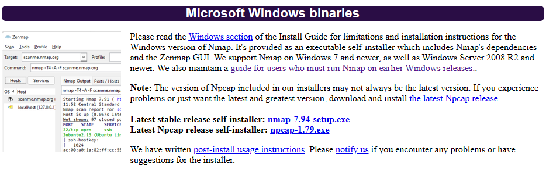
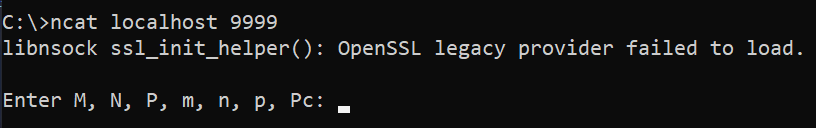
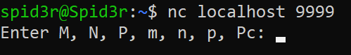

# Distributed Computing with Matrix Multiplication
## Overview

### Structure


- Master node: The largest computer responsible for partitioning the matrix, encoding, and distributing tasks to smaller worker nodes for computation. It also collects results from workers to verify integrity.
- Worker: A subordinate computer responsible for computing submatrices and sending results back to the server (which the Master node receives).
- Encode Function: Two encoding functions responsible for encoding the divided matrices using F, G functions.
### Advantages:
- Accelerates computation speed.
- Addresses large-scale matrix multiplication problems.
- Enhances scalability.
### Disadvantages:
- More complex compared to traditional methods.
- Requires a high-performance computer network (high processing speed and substantial configuration requirements).

## PolyDot Code without security (Algorithm)

Master node partition the matrix 

$$
\mathbf{X} = \begin{pmatrix}
X_{1,1} & \cdots & X_{1,n} \\
\vdots  & \ddots & \vdots \\
X_{m,1} & \cdots & X_{m,n}
\end{pmatrix}
\quad ,
\mathbf{Y} = \begin{pmatrix}
Y_{1,1} & \cdots & Y_{1,p} \\
\vdots  & \ddots & \vdots \\
Y_{n,1} & \cdots & Y_{n,p}
\end{pmatrix}
$$

where $m | M, n | N, p | P, X_{i,j} \in \mathbb{F}^{\frac{M}{m} \times \frac{N}{n}}, Y_{k, l} \in \mathbb{F}^{\frac{N}{n} \times \frac{P}{p}}$.

The resulting matrix $Z=XY$ is represented as follows:

$$
\mathbf{Z} = \begin{pmatrix}
Z_{1,1} & \cdots & Z_{1,p} \\
\vdots  & \ddots & \vdots \\
Z_{m,1} & \cdots & Z_{m,p}
\end{pmatrix}
\quad
$$

with
$$Z_{u, v} = \sum_{k=1}^{n} X_{u,k} Y_{v, k}, u \in {1, 2, ..., m},  v \in {1, 2, 3, ..., p}$$ 


### 1. Encode 
The Master node encodes the submatrices of X & Y using the functions F & G below:

$$
F(z) = \sum_{i=1}^{m} \sum_{j=1}^{n} X_{i,j} z^{n \cdot (i-1) + j-1}
$$

$$
G(z) = \sum_{k=1}^{n} \sum_{l=1}^{p} Y_{k,l} z^{n-k + mn(i-1)}
$$

where F and G are encode function satisfied F: $\mathbb{F}^{\frac{M}{m} \times \frac{N}{n}} \rightarrow \mathbb{F}^{\frac{M}{m} \times \frac{N}{n}}$ and G: $\mathbb{F}^{\frac{N}{n} \times \frac{P}{p}} \to \mathbb{F}^{\frac{N}{n} \times \frac{P}{p}}$

### 2. Task computing
$i$-th worker calculate $F(z_{i})G(z_{i})$. As soon as worker $i$ completes  the computation, it will send
the result back to themaster node, noting that the returned results from the workers may vary in speed depending on each worker’s computational capabilities, and the returned results may not be accurate.

$$
\begin{align*}
F(z)G(z) &= (\sum_{i=1}^{m} \sum_{j=1}^{n} X_{i, j} z^{n(i-1)+j-1}) \times \\
&\quad(\sum_{k=1}^{n} \sum_{l=1}^{p} Y_{k, l} z^{n-k + mn(l-1)}) \\
&= \sum_{i, j, k, l}^{}X_{i, j} Y_{k, l} Z ^{n(i-1)+j-1+n-k + mn(l-1)}
\end{align*}
$$

The coefficient of $Z_{u, v}$ in the  polynomial corresponding to the exponent z is $n(u-1) + n-1 +mn(v-1)$ in the case where the index $j = k$ in $X_{i,j}$ and $Y_{k,l}$
### 3. Decoding (Result recovering)
The master node will collect the fastest R results returned by the workers. Afterward, the master node will recover the result $Z_{i, j}$ with $i \in {1,2,...,m}, j \in {1,2,...,p}$ based on polynomial interpolation.

Since the degree of the polynomial is $mnp + n - 2$, when applying the polynomial interpolation method, a minimum of $mnp + n - 1$ values is required to achieve the fastest results from the workers for the recovery of the matrix $Z$. Therefore, the recovery threshold is:

$$
\begin{align*} 
P_R = mnp + n - 1
\end{align*}
$$

and communication load is:

$$
\begin{align*} 
C_L = P_D \frac{MP}{mp}
\end{align*}
$$
## PolyDot Code with security (algorithm)
### A. Generalized PloyDot with Security
#### 1. Encode
To accomplish this objective,we add rows or columns containing random elements to matrices A and B, respectively.From there, we consider two distinct cases:

##### a. Case 1: $n < m$

$$
\begin{align*} 
\Delta_{P_C} = \lceil \frac{P_C} {n}\rceil
\end{align*}
$$

Matrix $X^{*}$:

$$
X^{*} =
\begin{bmatrix}
X_{1,1} & \ldots & X_{1,n} \\
\vdots & \ddots & \vdots \\
X_{m,1} & \ldots & X_{m,n} \\
R_{1,1} & \ldots & R_{1,n} \\
\vdots & \ddots & \vdots \\
R_{\Delta_{P_C},1} & \ldots & R_{\Delta_{P_C},s}
\end{bmatrix}
$$

Matrix $Y^{*}$:

$$
Y^* =
\begin{bmatrix}
Y_{1,1} & \ldots & Y_{1,p} & R_{n,1} & \ldots & R_{n,\Delta_{P_C}} \\
\vdots & \ddots & \vdots & \vdots & \ddots & \vdots \\
Y_{n,1} & \ldots & Y_{n,p} & Y_{1,1} & \ldots & R_{1,\Delta_{P_C}}
\end{bmatrix}
$$

The encoding functions $F^{* }$ and $G^{* }$ are rewritten as follows:

$$
F^{* }(z) = \sum_{i=1}^{m} \sum_{j=1}^{n} X_{i,j}^{* }z^{n(i-1)+(j-1)} + \sum_{i=m+1}^{m^* } \sum_{j=1}^{n} X_{i,j}^{* }z^{n(i-1)+j-1}
$$

$$
G^{* }(z) = \sum_{k=1}^{n} \sum_{l=1}^{p} Y_{k,l}^{* }z^{n-k+m^{* }n(l-1) } + \sum_{k=1}^{n} \sum_{l=p+1}^{p^{* }} Y_{k,l}^{* }z^{m^{* }np+n(l-p)-k}
$$


##### b. Case 2: $n \geq m$

$$
\Delta_{P_C} = \left\lceil \frac{P_C}{\min\{m, p\}} \right\rceil
$$

Matrix $X^{* } \in \mathbb{F}^{t\times n^{* }}$ will take the form $[X \ R]$ with $n^{* } = n + \Delta_{P_C}$ obtained as

$$
X^{* } =
\begin{bmatrix}
X_{1,1} & \ldots & X_{1,n} & R_{1,1} & \ldots & R_{1,\Delta_{P_{C}}} \\
\vdots & \ddots & \vdots & \vdots & \ddots & \vdots \\
X_{m,1} & \ldots & X_{m,n} & X_{m,1} & \ldots & R_{m,\Delta_{P_{C}}}
\end{bmatrix}
$$

The matrix $Y^{* } = [R \ Y] \in \mathbb{F}^{n^{* }\times d}$ is represented as:

$$
Y^{* }=
\begin{bmatrix}
R_{\Delta_{P_C},1} & \ldots & R_{\Delta_{P_C},p} \\
\vdots & \ddots & \vdots \\
R_{1,1} & \ldots & R_{1,p} \\
Y_{1,1} & \ldots & Y_{1,p} \\
\vdots & \ddots & \vdots \\
Y_{n,1} & \ldots & Y_{n,p}
\end{bmatrix}
$$

The encoding function in this case will be represented: 

$$
\begin{equation}
\begin{aligned}
F^{* }(z) &= \sum_{i=1}^{m} \sum_{j=1}^{n} X_{i,j}^{* }z^{(i-1) + m(j-1)} \\
&\quad + \sum_{i=1}^{m} \sum_{j=n+1}^{n^{* }} X_{i,j}^{* }z^{(i-1) + m(j-1)}
\end{aligned}
\end{equation}
$$

$$
\begin{equation}
\begin{aligned}
G^{* }(z) &= \sum_{k=1+\Delta_{P_C}}^{p} \sum_{l=1}^{n^{* }} Y_{k,l}^{* }z^{(n^{* }-k)m + m(n^{* })(l-1)} \\
&\quad + \sum_{k=1}^{\Delta_{P_C}} \sum_{l=1}^{p} Y_{k,l}^{* }z^{m(n^{* }p-\Delta_{P_C}) + p(\Delta_{P_C}-k) + (l-1)}
\end{aligned}
\end{equation}
$$

#### 2. Verification key
Let $n_0=\frac{N}{n},m_0=\frac{M}{m},p_0=\frac{P}{p}$.

In case: $m_0 < p_0$, master node will generate the key $k_i$ corresponding to $F^{* }(z_i)$, where the vectors $k^{T}_{i} \in \mathbb{F}^{m^{* }}$, as follows:

$$
\begin{align*}
R_i = k_i F^{* }(z_i)
\end{align*}
$$

In case: $m_0 \geq p_0$, master node will generate vector $k_i \in \mathbb{F}^{p^{* }}$ corresponding to $G∗(z_i)$ as follow:


$$
\begin{align*}
R_i= G^{* }(z_i)k_i
\end{align*}
$$

#### 3. Task computing 
After generating the key, the master code will send $F^{* }(z_i)$ and $G^{* }(z_i)$ to each $i$-th worker. The workers perform computations:

$$
\begin{align*}
F_z(z_i) = F^{* }(z_i)G^{* }(z_i)
\end{align*}
$$

#### 4. Key checking

After receiving the result $F_z(z_i)$ returned by the $i$-th worker, the master code will proceed to perform a check:

$$
R_iG^{* } (z_i) = k_iF^{* }(z_i)G^{* }(z_i)
$$

$$
F^{* }(z_i)R_i = F^{* }(z_i)G^{* }(z_i)k_i
$$

corresponding to cases $m^{* }< p^{* }$ and $m^{* }\geq p^{* }$.
#### 5. Recover result

Similar to the recovery step mentioned above, the master node will collect the results returned from the worker nodes to determine the coefficients through polynomial interpolation. It is important to note that these returned results must satisfy the key-checking step to be considered valid. 
If the returned result is accurate, we add it to the $\mathbb{R_Z}$, and when $|R_z| \geq R_C$, the master node proceeds with decoding to obtain the final matrix.


### B. Recovery Threshold And Computation Load

#### a. Case $n < m$
For a given security level $P_{c} < P, t, s, d, n^{* }, p^{* }$ are given as mentioned above, the SPC code has the recovery threshold $P_R$ as follows:

$$
P_R =
\begin{cases} 
m^{* }n(p + 1) + n\Delta_{P_C} - 1, & \text{if } P_C \geq 1 \text{ and } \Delta_{P_C} = \frac{P_C}{n}, \\
m^{* }n(p + 1) - n\Delta_{P_C} + 2P_C - 1, & \text{if } P_C \geq 1 \text{ and } \Delta_{P_C} > \frac{P_C}{n},
\end{cases}
$$


#### b. Case $n \geq m$

For a given security level $P_{c} < P, t, s, d, n^{* }, p^{* }$ are given as mentioned above, the SPC code has the recovery threshold as follows:

$$
P_R = m(n^{* }p - \Delta_{P_C}) + mn + 2P_C - 1 
$$

And communication load in both cases: 

$$
C_L = P_R\frac{M^{* }P^{* }}{m^{* }p^{* }}
$$
## Run Project
### Install lib & config 
```
pip install -r requirements.txt
```
### Run server
```
python server.py
```

## Build Project with Docker (Server)
### Bash
```
cd Distributed-Computing
docker compose up
```
### Netcat from Windows (cmd)
You should use ncat in Windows: [Nmap tool](https://nmap.org/download.html)

```
ncat localhost 9999 
```

### Netcat from Linux (terminal)
```
nc localhost 9999
```


(**9999** is default port in this project, you can change port with [Dockerfile](Dockerfile) and [docker-compose.yml](docker-compose.yml))
## Contact
### Paper
Please check our research paper for more information: [A Secure PolyDot Matrix Multiplication Approach For Distributed Computing](/Paper-Research/A_Secure_PolyDot_Matrix_Multiplication_Approach_For_Distributed_Computing.pdf)
### Authors
1. Thai Son Dinh: sondinh99999@gmail.com
2. Dang Anh Duc Pham: anhduc03nb@gmail.com

Buy me a coffee ☕: https://www.buymeacoffee.com/spid3r

> Thank you for visiting and using this project! If you have any questions or need further assistance, please contact the authors.